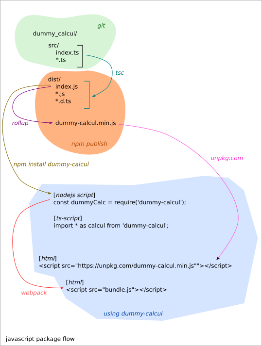

=====================
Notes on dummy_calcul
=====================

Javascript flow
===============

Generating the npm package
--------------------------

sources::

  src/index.ts

*tsc --declaration* generates::

  dist/index.js
  dist/index.d.ts

*rollup* generates from *dist/index.js*::

  dist/dummy-calcul.min.js

Using the npm package
---------------------

In a nodejs or ts script
------------------------

In a bash-terminal, install locally the npm-package::

  npm i dummy-calcul

In a nodejs-script::

  const dummyCalcul = require("dummy-calcul");

In a ts-script::

  import { add1000, mult1000 } from "dummy-calcul";
  // or
  // import * as dummyCalcul from "dummy-calcul";

In a html, for the browser
--------------------------

Two options are possible:

- Use the pre-bundle script from *unpkg.com*
- install locally with npm and create the bundle with *webpack*

Three popular bundle tools:

- webpack_
- rollup_
- parcel_

.. _webpack: https://webpack.js.org/
.. _rollup: https://rollupjs.org/guide/en/
.. _parcel: https://parceljs.org/

