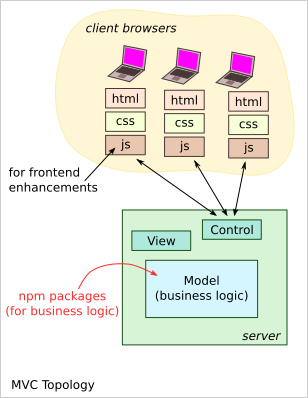
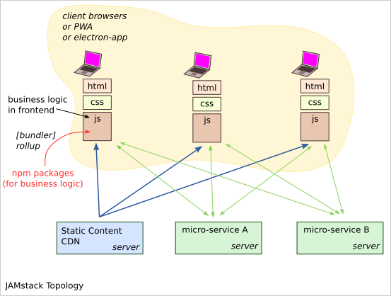

=====================
Notes on dummy_calcul
=====================

Javascript flow
===============

.. image:: javascript_package_flow.png

Generating the npm package
--------------------------

sources::

  src/index.ts

*tsc --declaration* generates::

  dist/index.js
  dist/index.d.ts

*rollup* generates from *dist/index.js*::

  dist/dummy-calcul.min.js

Using the npm package
---------------------

In a nodejs or ts script
------------------------

In a bash-terminal, install locally the npm-package::

  npm i dummy-calcul

In a nodejs-script::

  const dummyCalcul = require("dummy-calcul");

In a ts-script::

  import { add1000, mult1000 } from "dummy-calcul";
  // or
  // import * as dummyCalcul from "dummy-calcul";

In a html, for the browser
--------------------------

Two options are possible:

- Use the pre-bundle script from *unpkg.com*
- install locally with npm and create the bundle with *rollup*

Three popular bundle tools:

- webpack_
- rollup_
- parcel_

.. _webpack: https://webpack.js.org/
.. _rollup: https://rollupjs.org/guide/en/
.. _parcel: https://parceljs.org/

Web App Topologies
==================

MVC Topology
------------

This is the traditional topology. The business logic is on the server side. The client side contains just some enhancement logic. This approach is difficult to scale as the central server must process all user requests.

Frameworks for the MVC topology:

- sails_

.. _sails: https://sailsjs.com/

JAMstack Topology
-----------------

In this approach, we put the business logic on the client side. The client-app must run as much as possible independently from servers. The micro-services must be standard commodities when possible. The client-app is delivered by a static content server or pre-installed via PWA or electron-app. This approach is highly scalable as the server are less requested and the micro-services can be run on several machines.

Frameworks or libraries for the JAMstack approach:

- JAMstack_
- Stimulus_
- pug_

.. _JAMstack: https://jamstack.org/
.. _Stimulus: https://stimulusjs.org/
.. _pug: https://pugjs.org/

